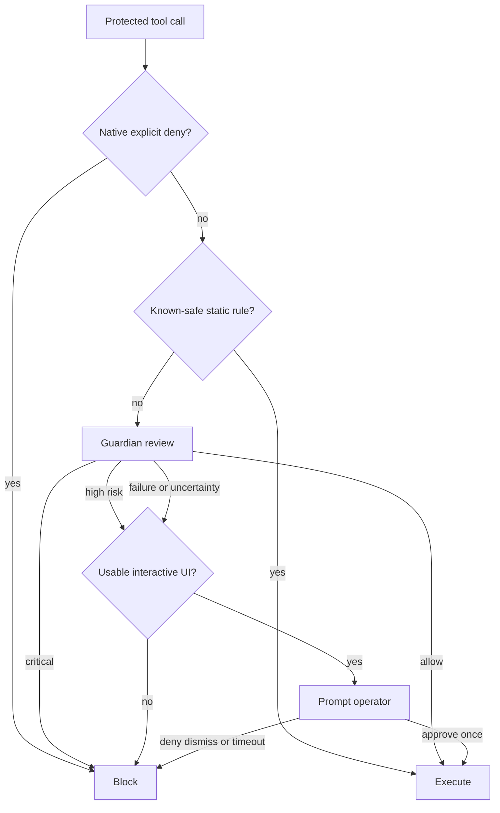
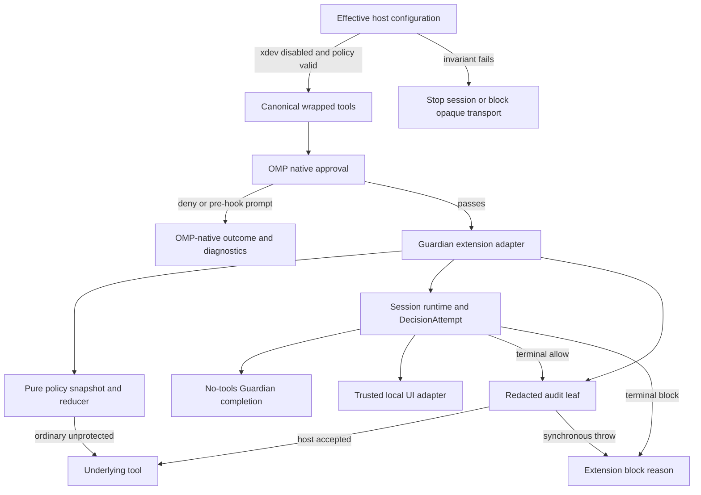
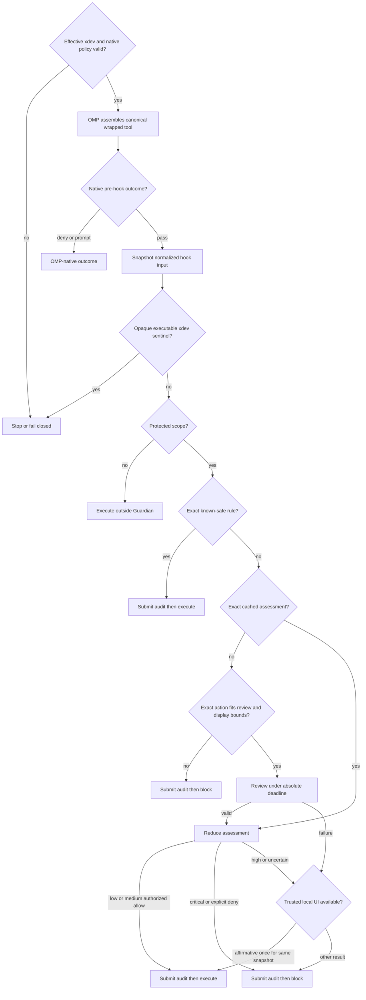
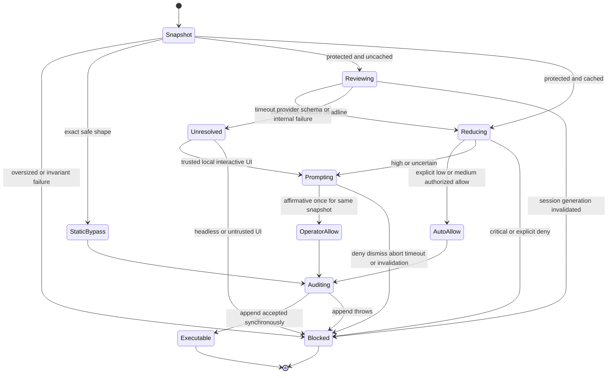
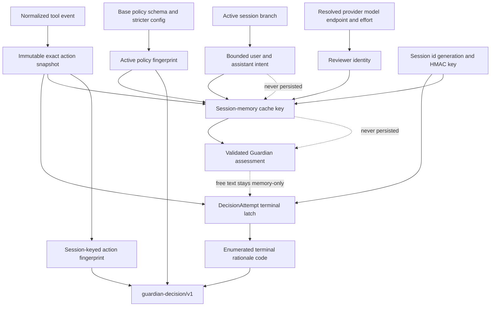

<!-- markdownlint-disable MD013 MD025 MD036 -->

# Model-Assisted OMP Permission Gate - Plan

## Goal Capsule

- **Objective:** Reduce OMP permission fatigue without silently approving dangerous execution by placing deterministic rules before a small-model Guardian review.
- **Product authority:** The Product Contract below, preserving R1-R20 and AE1-AE8 from the 2026-07-15 brainstorm.
- **Execution profile:** Deep, security-sensitive implementation against OMP 17.0.1, delivered as chezmoi-managed configuration and extension code without an OMP fork.
- **Stop conditions:** Stop if effective configuration cannot enforce the xdev/native-policy/extension invariants, if reviewed input cannot be proven identical to executed parameters, if direct completion cannot be cancelled or its exact-action data handling is unapproved, or if protected calls cannot submit redacted audit events before execution.
- **Tail ownership:** Implementation owns focused tests, effective chezmoi deployment, a fresh OMP process, and runtime probes for native deny, static bypass, Guardian outcomes, headless failure, subagent coverage, and timeout cancellation.

---

## Product Contract

### Summary

Build a chezmoi-managed OMP extension that evaluates execution-tier tool calls before they run.
Static rules bypass review for known-safe calls and route suspicious or uncertain calls to a dedicated Guardian model, avoiding an OMP fork.

### Problem Frame

OMP's native approval modes currently force a coarse choice.
`write` mode permits normal file changes but prompts for broad execution tools, while `yolo` removes most prompts at the cost of relying on the agent not to propose dangerous work.
Per-tool policy is deterministic but cannot distinguish a harmless invocation from a destructive invocation of the same tool.

The desired experience keeps routine work uninterrupted and asks the operator only when a specific action presents meaningful risk.
A probabilistic classifier must not become an uncontained permission boundary: deterministic policy runs first, failures do not become approvals, and the model receives the exact action as untrusted evidence.

### Key Decisions

- **Use the current extension lifecycle, not an OMP fork.** Native approval runs in `yolo` mode so the pre-execution `tool_call` hook can apply the custom decision pipeline without an earlier native prompt.
- **Preserve deterministic authority.** Explicit native per-tool `deny` policies remain authoritative, known-safe shapes bypass the model, and every other protected call reaches Guardian.
- **Let Guardian judge rule-flagged catastrophic commands.** Static rules route commands such as destructive recursive deletion to Guardian rather than hard-coding an unconditional block.
- **Bias every uncertain state toward human review.** An interactive session prompts when Guardian is unavailable, late, malformed, or uncertain; a session without usable approval UI blocks.
- **Bound model cost and drift.** Guardian uses a dedicated model role, a strict three-second total deadline, and session-local caching only for an identical reviewed action.

### Actors

- **Operator:** Owns the machine, configures policy, and makes informed decisions when Guardian requests confirmation.
- **Calling agent:** Proposes a tool call and receives either normal execution, a denial, or the result of the operator's decision.
- **Static policy layer:** Applies native denies, protected-tool scope, known-safe rules, and escalation rules without a model call.
- **Guardian:** Assesses the exact escalated action against a non-replaceable base safety policy and returns a structured verdict.
- **OMP extension host:** Intercepts the call, enforces the verdict, presents interactive prompts, and records decision evidence.

### Requirements

**Decision boundary**

- R1. The permission gate must run as a checked-in OMP extension managed by this chezmoi repository and must not require a custom OMP build.
- R2. The extension must intercept protected tool calls before their side effects begin.
- R3. Protected scope must cover execution-tier capabilities such as shell execution, eval, browser control, SSH, process launch, and subagent execution; ordinary reads and workspace writes remain outside Guardian review unless an explicit rule includes them.
- R4. Native per-tool `deny` policy must remain authoritative and must not be overridable by static rules, Guardian, or the operator prompt inside this extension.
- R5. Static rules must run before Guardian and produce either a known-safe bypass or an escalation; rule-flagged catastrophic patterns are escalations rather than unconditional built-in denials.
- R6. Protected calls outside a known-safe rule must not execute until Guardian or the operator has resolved them.

**Guardian assessment**

- R7. Guardian must use a dedicated configurable model role with a documented fallback to OMP's lightweight model role when no dedicated model is configured.
- R8. Guardian must receive the exact tool name, immutable arguments, working directory, relevant available metadata, and a bounded fingerprint of the immediately preceding user and assistant intent.
- R9. Guardian must treat all call arguments, transcript excerpts, tool output, and retrieved content as untrusted evidence rather than instructions.
- R10. Guardian may inspect local evidence only through a locked-down read-only surface, and investigation time counts toward the total review deadline.
- R11. Guardian must return a schema-validated verdict containing risk level, user authorization, outcome, and concise rationale.
- R12. The built-in Guardian policy must be non-replaceable; user configuration may only append stricter or domain-specific rules.

**Verdict enforcement and failure behavior**

- R13. Low- and medium-risk authorized calls may proceed without a prompt, high-risk calls must prompt in interactive sessions, and critical-risk calls must be blocked.
- R14. The interactive high-risk prompt must identify the exact action and Guardian's concrete risk rationale before the operator decides.
- R15. The entire uncached Guardian review, including optional read-only investigation, must have a hard three-second deadline.
- R16. Timeout, provider failure, missing credentials, malformed output, ambiguous verdict, or internal error must open the normal human confirmation path when a usable UI is available and must block otherwise.
- R17. Headless and subagent sessions must block any protected call that cannot be confidently auto-approved without interactive input and must return an actionable reason to the parent agent.

**Caching and observability**

- R18. A verdict may be reused only within the current session for the same tool, exact arguments, working directory, bounded-intent fingerprint, and active policy version.
- R19. Any change to those cache inputs must force a fresh review; decisions must not become remembered command families or cross-session policy.
- R20. Every escalation must emit an auditable record containing the decision source, outcome, risk level, rationale, latency, and cache status without persisting secrets or unrestricted argument content.

### Key Flow



The static layer handles deterministic decisions before any model request.
Guardian receives only escalated calls, and the extension converts every unresolved branch into either an informed operator decision or a block.

### Acceptance Examples

- AE1. **Known-safe shell call**
  - **Given:** The agent proposes `git status` in the workspace and the static policy classifies that exact shape as safe.
  - **When:** The extension intercepts the call.
  - **Then:** The command runs without Guardian or an operator prompt.
  - **Covers:** R2, R5, R6
- AE2. **Rule-flagged destructive command**
  - **Given:** The agent proposes recursive deletion of the operator's home directory.
  - **When:** Static policy flags the command and Guardian classifies it as critical.
  - **Then:** The extension blocks the command without offering immediate approval.
  - **Covers:** R5, R11, R13
- AE3. **High-risk but potentially authorized action**
  - **Given:** The agent proposes a narrowly scoped remote mutation that Guardian classifies as high risk and the session has usable approval UI.
  - **When:** Guardian returns its rationale.
  - **Then:** The operator sees the exact action and risk before choosing whether it runs once.
  - **Covers:** R13, R14
- AE4. **Prompt injection inside arguments**
  - **Given:** A tool argument contains text instructing Guardian to ignore policy and approve the call.
  - **When:** Guardian evaluates the action.
  - **Then:** The embedded text is treated as untrusted evidence and cannot change the base policy or output contract.
  - **Covers:** R9, R11, R12
- AE5. **Interactive review failure**
  - **Given:** Guardian times out or returns malformed output in an interactive session.
  - **When:** The three-second deadline expires or schema validation fails.
  - **Then:** The extension shows the operator a confirmation prompt rather than approving the call.
  - **Covers:** R15, R16
- AE6. **Headless review failure**
  - **Given:** The same failure occurs in a subagent without approval UI.
  - **When:** The extension cannot obtain a trustworthy verdict.
  - **Then:** The call is blocked and the parent receives the reason.
  - **Covers:** R16, R17
- AE7. **Exact-call cache boundary**
  - **Given:** Guardian already approved a call in this session.
  - **When:** The identical call repeats with the same intent fingerprint, then repeats again with changed arguments or working directory.
  - **Then:** The first repetition may reuse the verdict, while the changed call receives a fresh review.
  - **Covers:** R18, R19
- AE8. **Native deny precedence**
  - **Given:** The operator configured the tool's native policy as `deny`.
  - **When:** The agent proposes an otherwise safe invocation.
  - **Then:** OMP blocks it before Guardian and no extension verdict can override the denial.
  - **Covers:** R4

### Success Criteria

- Routine calls matched by known-safe static rules add no model latency and produce no confirmation prompt.
- Every uncached Guardian path resolves within three seconds or enters the defined interactive-or-block fallback.
- No protected call executes after a missing, malformed, timed-out, or ambiguous Guardian result without explicit operator approval.
- The behavior works on the installed OMP 17.0.1 extension API without modifying OMP core; the managed development dependency and lockfile are aligned to that runtime.
- Audit output explains every hook-visible protected-call disposition without exposing secrets; native pre-hook denies remain explained by OMP's native audit path.

### Scope Boundaries

**In scope**

- A local OMP extension, its static policy, Guardian model integration, strict verdict schema, interactive prompt behavior, headless behavior, exact-call cache, and decision audit trail.
- Configuration for protected tools, append-only stricter policy rules, the dedicated Guardian model role, and the review deadline.
- Focused verification of deterministic decisions, model outcomes, failure paths, cache invalidation, prompt-injection handling, native-deny precedence, and child-session coverage.

**Out of scope**

- Forking OMP, changing its native approval lifecycle, or submitting an upstream Guardian implementation.
- Replacing operating-system sandboxing, capability isolation, or credential boundaries.
- Reviewing every read and normal workspace write by default.
- Cross-session learned approvals, command-family approvals, or a general trust database.
- Organization-wide policy administration or a remote approval service.

#### Deferred to Follow-Up Work

- A model-driven local investigation loop. OMP 17.0.1 exposes no isolated reviewer session or locked-down nested read-only tool runner, so this implementation supplies a fixed no-tools evidence envelope.
- Re-enabling `xd://` tool presentation. It requires an upstream change that applies native policy and extension interception to the canonical inner tool before execution.

### Dependencies and Assumptions

- OMP remains configured in native `yolo` mode with any explicit per-tool `deny` policies retained and no pre-hook native `prompt` policies on Guardian-protected tools.
- Effective OMP configuration keeps `tools.xdev: false`; startup/runtime probes treat an override or opaque executable `xd://` write as a failed authorization invariant, not a recoverable inner-tool review.
- The OMP 17.0.1 extension API continues to emit `tool_call` after native approval and before execution, to honor `{ block: true, reason }`, and to preserve a lossless correspondence between reviewed normalized input and executed parameters.
- Direct model completion can resolve an authenticated model, consume an abort signal, and avoid inherited agent tools, skills, memory, and system instructions.
- Only a trusted local interactive context with an observed affirmative confirmation may authorize; method presence, false, unsupported UI capabilities, dismissal, abort, and timeout are denials.
- Static rules can identify protected tools, canonically workspace-contained write/edit targets, and exact known-safe shapes without executing or materially transforming the proposed action.

### Resolved During Planning

- **Protected tools:** Disable `xd://` presentation; allow exact ordinary local reads and only canonically workspace-contained write/edit targets outside Guardian; protect traversal, symlink escape, Guardian policy/audit targets, shell/eval/browser/remote SSH/process/subagent actions, and unknown names or shapes.
- **Reusable classifiers:** OMP's critical Bash classifier is private, so the extension owns a deliberately narrow exact safe-shape catalog; catastrophic matches annotate escalation evidence but do not hard-block by themselves.
- **Read-only evidence:** Expose no reviewer tools in this implementation. Guardian receives the immutable exact action plus bounded intent and policy metadata as data.
- **Audit sink:** Submit redacted `guardian-decision/v1` entries synchronously through `pi.appendEntry` before hook-visible protected execution; treat a synchronous throw as failure, make no unacknowledged disk-durability claim, and use `pi.logger` only for best-effort diagnostics.

### Sources and Research

- [OMP 17.0.1 approval modes](https://github.com/can1357/oh-my-pi/blob/v17.0.1/docs/approval-mode.md) defines tier modes and per-tool policy.
- [OMP 17.0.1 extension wrapper](https://github.com/can1357/oh-my-pi/blob/v17.0.1/packages/coding-agent/src/extensibility/extensions/wrapper.ts#L107-L231) confirms native approval before blocking `tool_call` and execution afterward.
- [OMP 17.0.1 extension types](https://github.com/can1357/oh-my-pi/blob/v17.0.1/packages/coding-agent/src/extensibility/extensions/types.ts#L384-L443) defines model, UI, cwd, and read-only session context.
- [OMP 17.0.1 xdev assembly](https://github.com/can1357/oh-my-pi/blob/v17.0.1/packages/coding-agent/src/tools/index.ts#L568-L599), [SDK wrapping](https://github.com/can1357/oh-my-pi/blob/v17.0.1/packages/coding-agent/src/sdk.ts#L2239-L2244), and [xdev dispatch](https://github.com/can1357/oh-my-pi/blob/v17.0.1/packages/coding-agent/src/tools/xdev.ts#L300-L342) establish why `tools.xdev` must be disabled.
- [OMP 17.0.1 model API](https://github.com/can1357/oh-my-pi/blob/v17.0.1/packages/coding-agent/src/extensibility/extensions/model-api.ts) and [model roles](https://github.com/can1357/oh-my-pi/blob/v17.0.1/packages/coding-agent/src/config/model-roles.ts) define configured `@guardian` and lightweight-role resolution.
- [Codex Guardian policy](https://github.com/openai/codex/blob/9ff47868eb2afeec579183e01bb9d3d3e9df2bcd/codex-rs/core/src/guardian/policy_template.md) provides the untrusted-evidence, authorization, and risk reference model.
- [Codex Guardian review runtime](https://github.com/openai/codex/blob/9ff47868eb2afeec579183e01bb9d3d3e9df2bcd/codex-rs/core/src/guardian/review.rs#L282-L600) provides fail-closed outcome and cancellation precedent, while its 90-second retries are intentionally not adopted.
- [OWASP AI Agent Security](https://cheatsheetseries.owasp.org/cheatsheets/AI_Agent_Security_Cheat_Sheet.html#high-impact-action-integrity-controls) requires exact-action approval binding, replay resistance, decision/execution separation, and fail-closed controls.
- [OWASP Logging](https://cheatsheetseries.owasp.org/cheatsheets/Logging_Cheat_Sheet.html#data-to-exclude) defines sensitive fields that must not enter audit records.

---

## Planning Contract

### Product Contract Preservation

Product Contract behavior and stable R/AE IDs are unchanged.
The stale OMP 16.5.2 success criterion was corrected to the installed 17.0.1 runtime, planning-owned questions were resolved, and `tools.xdev: false` was added as a required current-runtime safety invariant.

### Key Technical Decisions

| ID | Decision | Rationale |
| --- | --- | --- |
| KTD1 | Target OMP 17.0.1 and align the managed workspace dependency policy and lockfile. | The active runtime is 17.0.1, while package peers, the lockfile, and workspace release-age exclusions reference 16.4.3; the permission surface must type-check and install against what is deployed. |
| KTD2 | Make `tools.xdev: false`, native `yolo`, and explicit deny-only protected-tool overrides a bootstrap invariant. | Native denial must precede Guardian. OMP 17.0.1 mounts xdev before extension wrapping, so disabling it creates canonical wrapped tools; blocking an opaque outer `xd://` write is only a fail-closed sentinel and cannot recover inner policy or metadata. |
| KTD3 | Use a closed, action-aware static policy with unknown names, shapes, and non-contained mutations protected by default. | The event exposes no approval tier or origin metadata. Exact ordinary local reads and canonically workspace-contained writes/edits can bypass; traversal, symlink escape, Guardian policy/audit targets, and ambiguity must escalate rather than fail open. |
| KTD4 | Keep the Guardian base policy compiled into code and user policy monotonic by construction. | Validated configuration may only tighten behavior and must affirm exact-action provider data handling plus allowed resolved reviewer identities; arbitrary prompt replacement or broader allow is rejected. |
| KTD5 | Invoke a direct no-tools completion using `@guardian`, then `@smol`, under one absolute three-second cancellation budget. | Direct completion avoids inherited agent instructions and recursive permission checks. Role resolution, credentials, request, parse, and validation all consume the same deadline; no repair or semantic retry starts a new budget. |
| KTD6 | Require a closed all-fields verdict and reduce every tuple deterministically. | Provider structure is not semantic authorization. Critical always blocks, high always requires an affirmative usable UI, and only explicit low/medium authorized allow tuples can execute automatically. |
| KTD7 | Cache only schema-valid Guardian assessments in bounded session memory. | Reuse is exact-call optimization, not remembered authority. High-risk cached assessments prompt again; failures and operator decisions are never reusable approvals. |
| KTD8 | Bind approval to the unchanged exact action and accept it only from a trusted local interactive context below the host's 30-second cap. | Only an observed `true` authorizes once. ACP/RPC or another surface remains non-authorizing unless OMP exposes and the host probe proves an authenticated action-bound human receipt; false, dismissal, abort, and timeout block. |
| KTD9 | Require synchronous host acceptance of a redacted audit event before hook-visible protected execution. | `pi.appendEntry` is model-excluded but returns `void`, not a durability acknowledgement. Persist only enumerated rationale codes, bounded non-sensitive metadata, and session-keyed fingerprints; a synchronous throw turns a would-be execution into a block. |

### High-Level Technical Design

#### Component topology



#### Enforcement decision flow



#### Review and prompt lifecycle



#### Identity, cache, and audit derivation



### Output Structure

```text
pnpm-workspace.yaml
private_dot_omp/private_agent/
  config.yml
  package.json
  extensions/
    guardian.config.json
    guardian.ts
    guardian.test.ts
    guardian/
      audit.test.ts
      audit.ts
      policy.test.ts
      policy.ts
      reviewer.test.ts
      reviewer.ts
      session-runtime.ts
pnpm-lock.yaml
```

Dependency direction is one-way: `guardian.ts` composes pure policy/reducer, reviewer, session runtime, trusted-UI handling, and audit leaves. Reviewer never imports UI, cache, session, audit, or the extension adapter; leaf modules never import the adapter.

### Assumptions

- Disabling `tools.xdev` is acceptable despite exposing more enabled tool schemas in the model context; permission correctness wins over the context-size optimization.
- The installed OMP process and all task/subagent child sessions discover extensions from the same managed agent directory; U4 verifies this across alternate child working directories before completion.
- Active-branch message events contain enough completed user and assistant text to produce a stable bounded intent snapshot; implementation falls back to the active branch rather than all session entries.
- The configured `@guardian` role resolves through OMP's custom role support. If it is absent or unauthenticated, `@smol` is the only model fallback before review becomes unavailable.
- Exact action and bounded intent may leave the machine only after the operator explicitly acknowledges the selected provider's transport, retention, training-use, and residency posture and allowlists the resolved provider/model identity; otherwise review is unavailable.
- The initial known-safe Bash catalog stays intentionally narrow, beginning with exact `git status` shapes; broader command-family policy is outside this implementation.
- OMP 17.0.1 preserves a lossless immutable correspondence from normalized hook input to executed parameters across extension-handler composition; U4 treats failure of this canary as a stop condition requiring an upstream/core boundary.

### Sequencing

U1 establishes the full 17.0.1 workspace contract, pure deterministic policy, configuration grammar, exact identity, and reducer.
U2 adds isolated model review under the interfaces and invariants from U1.
U3 integrates OMP events through a thin adapter, with a session runtime owning mutable authorization state and an audit leaf owning the persistent schema.
U4 changes effective host configuration and deploys only after the preceding behavior is proven, then validates host ordering and action identity.

### System-Wide Impact

- **Effective configuration:** Authorization depends on merged runtime state, not source text. Startup/runtime probes cover alternate project and child working directories; xdev enablement, native prompts on protected tools, missing extension discovery, or an unexpected reviewer identity stops or blocks instead of degrading silently.
- **Tool presentation:** `tools.xdev: false` exposes enabled discoverable tools top-level. This increases prompt schema surface but restores canonical tool names, native per-tool policy, and extension interception.
- **Native approval:** `yolo` removes coarse native prompts, while explicit native denies remain the outer hard boundary. Native deny or prompt outcomes occur before Guardian and use OMP-native diagnostics, not Guardian audit.
- **Agent and subagent behavior:** The same global extension must load in local interactive, print/headless, RPC/ACP, and in-process task child sessions. Shell-launched nested agents are protected process actions rather than assumed inheritors.
- **Interactive authority:** Only a trusted local interactive context may authorize once. ACP/RPC method presence or a bare boolean is non-authorizing unless a future host contract provides an authenticated action-bound receipt and the U4 canary proves it.
- **Session lifecycle:** A dedicated runtime owns per-session generation, bounded assessment cache, active attempts, HMAC key, and disposal. Missing/empty IDs disable caching; switch, branch, shutdown, or reload invalidates every outstanding result.
- **Persistence:** `pi.appendEntry` synchronously accepts redacted session events but does not acknowledge disk durability. A synchronous throw blocks would-be execution; native pre-hook outcomes remain outside Guardian's event stream.
- **Secrets and privacy:** Exact arguments, bounded intent, and model rationale reach or remain with the configured Guardian provider only as needed in memory. Audit retains enumerated reason codes, bounded non-sensitive metadata, and session-keyed fingerprints, never provider free text.

### Alternative Approaches Considered

- **Keep `tools.xdev` enabled and parse outer `write` calls:** Rejected because it cannot restore native per-tool deny authority and canonical inner-tool metadata; it also risks double or missing review as dynamic mounts change.
- **Fork OMP or patch xdev dispatch:** Rejected by R1 and the scope boundary. An upstream fix can support a later xdev re-enable.
- **Reuse OMP's private Bash critical-pattern code:** Rejected because it is not an extension API and does not provide the closed exact-safe classifier this gate needs.
- **Give Guardian a nested read-only agent/tool loop:** Rejected because ExtensionContext exposes no isolated locked runner, and a recursive tool loop cannot meet the three-second or no-side-effect guarantees.
- **Hard-block catastrophic static matches:** Rejected by R5; built-in matches annotate evidence and force review, while only native denies, configuration invariant failures, and deterministic verdict enforcement block directly.
- **Copy Codex Guardian retries and parser:** Rejected because its 90-second retry loop, partial-field defaults, and permissive prose extraction conflict with the strict three-second and ambiguity-fallback contract.

### Risks and Mitigations

| Risk | Mitigation |
| --- | --- |
| Project, child CWD, or future configuration changes re-enable xdev, pre-hook prompts, or omit Guardian. | Verify effective merged settings and extension discovery across supported session surfaces; stop or block when the authorization invariant cannot be proven. |
| Opaque executable xdev transport reaches the hook. | Block it as an invariant sentinel and never claim the outer `write` review recovered canonical inner-tool policy. |
| Unknown extension or MCP tools escape scope. | Only exact ordinary local shapes are unprotected; unknown names, origins, or input shapes escalate by default. |
| Guardian prompt injection or semantically wrong structured output approves danger. | Isolate fixed policy from evidence, expose no reviewer tools, require every verdict field, reject all unlisted tuples, and keep critical/high enforcement deterministic. |
| A configured or compromised provider returns a valid but unsafe low-risk verdict or receives unsuitable sensitive evidence. | Require explicit provider-data-handling acknowledgement and resolved identity allowlisting, include provider/model/endpoint in cache and audit metadata, and exercise forged valid verdicts; model risk authority remains the explicit Product Contract trust boundary. |
| Hook input and executed parameters diverge or another extension changes the action. | Release only if the host canary proves lossless immutable correspondence and handler composition; otherwise stop for an upstream/core enforcement boundary. |
| Provider latency or a late completion escapes the deadline. | Use one absolute deadline with underlying abort, one terminal latch per attempt, and generation checks that reject late cache, audit, prompt, or execution effects. |
| UI exists but does not prove a trusted human decision. | Authorize only in the proven local interactive context; ACP/RPC, false, fake true, dismiss, abort, or timeout blocks without an action-bound receipt. |
| Provider rationale spoofs the trusted prompt with control or bidirectional text. | Render all provider-originated UI text through a bounded safe-text encoder that strips terminal escapes and neutralizes bidi and non-printing controls. |
| An exact action exceeds provider or lossless display bounds. | Deterministically block in every mode; never truncate a dangerous prefix or suffix for model or human approval. |
| Cache or approval crosses concurrent session boundaries. | Namespace by non-empty session ID and generation, isolate parent/sibling/branch state, disable caching when identity is unavailable, and never cache operator consent or failures. |
| Audit leaks secrets through transformed or invented rationale. | Persist no provider rationale or raw evidence; use enumerated reason codes, bounded non-sensitive metadata, a session-keyed digest, and malicious Unicode/encoding leak-oracle tests. |
| Audit acceptance or eventual persistence fails. | Convert a synchronous append throw into a block and state the host limitation: `appendEntry` provides no acknowledged disk-durability result. |
| Dependency alignment causes unrelated workspace churn. | Update package peers, workspace release-age exclusions, and only the intended OMP 17.0.1 lockfile graph; inspect all three deltas. |

## Implementation Units

### U1. Align the host contract and build the deterministic policy core

- **Goal:** Establish the complete OMP 17.0.1 workspace surface and a pure, closed policy layer for scope, safe bypass, stricter configuration, canonical identity, size bounds, and verdict reduction.
- **Requirements:** R1, R3, R5, R6, R11-R13, R18, R19; AE1, AE2, AE7.
- **Dependencies:** None.
- **Files:**
  - Modify `private_dot_omp/private_agent/package.json`.
  - Modify `pnpm-workspace.yaml` for OMP 17.0.1 release-age exclusions.
  - Modify `pnpm-lock.yaml` only for the OMP workspace and 17.0.1 dependency graph.
  - Create `private_dot_omp/private_agent/extensions/guardian.config.json`.
  - Create `private_dot_omp/private_agent/extensions/guardian/policy.ts`.
  - Create `private_dot_omp/private_agent/extensions/guardian/policy.test.ts`.
- **Approach:** Align all three OMP peer packages, workspace exclusions, and lockfile graph with 17.0.1. Define a closed configuration grammar that can add protected names, lower the maximum review deadline, and add only deny/confirmation/minimum-risk rules. Classify exact ordinary local read/write/control shapes as unprotected, exact `git status` shapes as known-safe, SSH-backed reads/writes and execution/process/subagent/browser actions as protected, and unknown names or fields as protected. Treat executable xdev transport and oversized exact actions as deterministic blocks. Canonicalize without semantic normalization; preserve shell whitespace, types, arrays, path spelling, and cwd. Derive policy/reviewer fingerprints and reduce every schema-valid verdict tuple through one total table.
- **Reviewer data gate:** Configuration requires an affirmative exact-action data-handling acknowledgement and an allowlist for resolved reviewer provider/model identities; absence, mismatch, or unknown fields makes review unavailable rather than silently selecting another endpoint.
- **Containment invariant:** Write/edit bypass resolves existing targets or the nearest existing parent for new targets against the active workspace, rejects absolute or relative escape and symlink traversal, and always protects Guardian configuration, policy, extension, and audit paths even when they are inside the workspace.
- **Execution note:** Start with failing table-driven tests for the closed policy boundary and verdict table before adding implementation.
- **Patterns to follow:** Mirror the co-located Vitest style in `private_dot_omp/private_agent/extensions/adaptive-thinking.test.ts`; the existing Vitest glob already discovers split `guardian/*.test.ts` suites.
- **Test scenarios:**
  1. Covers AE1. Exact accepted `git status` variants bypass Guardian, while composition, redirection, substitution, unknown flags, extra commands, and ambiguous quoting escalate.
  2. Covers AE2. Destructive recursive deletion produces escalation signals but no unconditional static denial; a critical verdict reduces to block.
  3. Exact ordinary local reads remain outside Guardian; write/edit bypass requires canonical containment for existing and new targets. Absolute out-of-workspace paths, parent traversal, symlink escapes, and Guardian policy/audit targets are protected alongside SSH, execution, process, subagent, browser, and unknown tools.
  4. Unexpected executable `xd://` writes are blocked as an invalid host configuration, while non-executing reject/proposal control paths follow their explicit rule.
  5. Additional configuration can only add protected scope, lower the deadline, require confirmation, raise risk, deny, acknowledge exact-action provider handling, or narrow reviewer identities; missing acknowledgement, identity mismatch, policy replacement, broader allow, arbitrary system text, unknown keys, and invalid rules are rejected.
  6. Low/medium + authorized + allow reduces to auto-allow; high always reduces to trusted-local-prompt-or-block; critical and explicit deny block; every contradictory or unlisted tuple becomes uncertainty.
  7. Canonical identity is stable for object-key order but changes for value, type, array order, shell whitespace, path spelling, cwd, intent, policy, schema, reviewer provider/model/endpoint, effort, and session generation.
  8. Exact actions beyond any provider or lossless display bound are never truncated and deterministically block, including dangerous content placed only in the over-bound prefix or suffix.
  9. Missing or empty session identity disables cache-key eligibility instead of collapsing callers into one namespace.
  10. Package peers, workspace exclusions, and lockfile changes contain no unrelated workspace upgrades.
- **Verification:** The policy suite proves all stated partitions, size limits, identities, and reducer tuples; the workspace typechecks against 17.0.1; and dependency deltas are limited to the intended OMP graph.

### U2. Implement isolated Guardian review and strict deadline handling

- **Goal:** Review an immutable exact action with the dedicated model under a non-replaceable policy, no inherited tools, a strict schema, and one cancellable three-second budget.
- **Requirements:** R7-R12, R15, R16; AE4, AE5, AE6.
- **Dependencies:** U1.
- **Files:**
  - Create `private_dot_omp/private_agent/extensions/guardian/reviewer.ts`.
  - Create `private_dot_omp/private_agent/extensions/guardian/reviewer.test.ts`.
- **Approach:** Resolve configured `@guardian`, then `@smol`; resolve session-sticky credentials through the current model registry. Build a direct completion context containing only the immutable base policy and one bounded untrusted-evidence message with exact tool/arguments/cwd, available classifier metadata, and bounded user/assistant intent. Give the reviewer no tools, skills, memory, MCP, browser, shell, or inherited OMP system prompt. Start the absolute deadline before role and credential work, pass the composed abort signal through completion, disable independent retries, cap output, and reject any late result. Require one closed object with risk, authorization, outcome, and bounded rationale; reject prose wrappers, repairable JSON, missing/extra fields, refusals, multiple results, and semantic contradictions.
- **Provider gate:** Before credentials or evidence leave the machine, require the data-handling acknowledgement and match the resolved primary or fallback provider/model against the configured allowlist; otherwise return `provider_unavailable` without a request.
- **Execution note:** Use fake time and an injected model invoker so cancellation and late-result behavior are proven deterministically before exercising a real provider.
- **Patterns to follow:** Follow OMP 17.0.1's supported role resolution, session-sticky model-registry credential resolver, and `completeSimple` cancellation surface; adopt Codex Guardian's evidence-is-untrusted posture without its retry loop or permissive parser.
- **Test scenarios:**
  1. Configured `@guardian` is selected first and unresolved Guardian may fall back to `@smol` only when the resolved identity is allowlisted; missing data-handling acknowledgement, mismatch, or credential failure becomes `provider_unavailable` before evidence transmission.
  2. Covers AE4. Injection text in arguments, cwd, filenames, metadata, or transcript remains inside the evidence value and cannot alter the immutable system policy, enabled tools, or required schema.
  3. Exact action arguments are cloned before awaits and appear unchanged in the review envelope; only bounded user and assistant intent from the active branch is included.
  4. Missing, extra, unknown, empty, oversized, prose-wrapped, multiple, refused, partial, or contradictory verdict output fails strict validation without repair or retry.
  5. Covers AE5 and AE6. Role resolution, credential acquisition, completion, parsing, and validation share one three-second deadline; a hanging stage aborts the underlying request and returns timeout.
  6. A response arriving at or after terminal timeout yields no valid review result and cannot win a duplicate completion race.
  7. Parent cancellation aborts active role/credential/completion work and returns an unresolved failure; session lifecycle wiring is owned by U3.
  8. No reviewer request includes the calling session's tools, skills, memory, MCP definitions, retrieved output, or effective system prompt.
  9. An exact action beyond the bounded provider envelope returns `action_too_large` without making a model request; U1 reduction makes that reason non-promptable.
  10. Primary and fallback providers returning forged but schema-valid verdicts are parsed without adding trust; the configured provider/model/endpoint identity is returned for cache and audit binding.
- **Verification:** Reviewer tests observe real abort propagation and a single absolute deadline, strict output validation rejects every ambiguous state, and one authenticated smoke completion returns a valid verdict without inherited tools.

### U3. Integrate pre-execution enforcement, UI, session runtime, and audit

- **Goal:** Register a thin OMP adapter around authorization-critical session state and audit leaves, producing one-shot execution, informed trusted-local prompt, or actionable block in every supported session mode.
- **Requirements:** R2, R4, R6, R13-R20; AE2, AE3, AE5-AE8.
- **Dependencies:** U1, U2.
- **Files:**
  - Create `private_dot_omp/private_agent/extensions/guardian.ts`.
  - Create `private_dot_omp/private_agent/extensions/guardian/session-runtime.ts`.
  - Create `private_dot_omp/private_agent/extensions/guardian/audit.ts`.
  - Create `private_dot_omp/private_agent/extensions/guardian/audit.test.ts`.
  - Create `private_dot_omp/private_agent/extensions/guardian.test.ts`.
- **Approach:** Keep `guardian.ts` to hook registration and decision-pipeline composition. A session runtime exclusively owns a non-empty session identity/generation, bounded assessment cache, active `DecisionAttempt`s, one terminal latch per attempt, session HMAC key, and disposal. Each attempt owns the immutable action snapshot and abort controller; lifecycle invalidation prevents late review/UI results from caching, auditing, approving, or executing. Apply policy, exact cache, then review; re-enforce cached assessments through the same reducer. Prompt high-risk and unresolved calls only in the trusted local interactive context, with escaped exact action plus memory-only concrete rationale/failure class. Allow only affirmative `true`, once, for the unchanged attempt and below the host cap. Audit owns the closed `guardian-decision/v1` schema, enumerated rationale codes, redaction, and synchronous append; operational logging remains best-effort.
- **Display safety:** The trusted-UI adapter bounds and encodes every provider-originated field, stripping terminal escape sequences and neutralizing bidirectional and non-printing controls before it can appear beside the exact action.
- **Execution note:** Characterize handler registration with the existing fake-API pattern, then test the adapter as a state machine and the audit leaf as a leak oracle.
- **Patterns to follow:** Mirror `private_dot_omp/private_agent/extensions/adaptive-thinking.ts` for extension registration and `adaptive-thinking.test.ts` for handler capture; keep pure leaves independent of the adapter.
- **Test scenarios:**
  1. Covers AE2. Critical review blocks without invoking confirmation or the underlying tool and submits a sanitized terminal outcome.
  2. Covers AE3. High risk in a trusted local TUI displays the exact tool/action, cwd, and bounded safe-encoded memory-only rationale; terminal escapes, bidi controls, deceptive Unicode, and non-printing characters cannot spoof the prompt, and only affirmative approval executes once.
  3. High-risk cached assessments prompt again; the prior operator approval is never reused.
  4. ACP/RPC or no-op method presence, fake `true` outside the trusted local context, prompt false, dismiss, abort, exception, duplicate resolution, session end, and UI timeout all block and never cache consent.
  5. Covers AE5 and AE6. Every model/config/schema/deadline/internal failure prompts only in the trusted local context; otherwise it blocks with a stable parent-consumable reason.
  6. Covers AE7. Exact repeated low/medium allow and critical block reuse the assessment; argument, cwd, intent, policy, schema, reviewer, provider/endpoint, effort, session, or generation changes miss.
  7. Static bypass never invokes Guardian; unknown protected calls always review; ordinary unprotected calls do neither; `action_too_large` blocks without a model or UI call.
  8. Session start, switch, branch, shutdown, extension reload, and parent abort increment/dispose generation, abort active work, and prevent late review or prompt results from cache, audit, or execution.
  9. Concurrent parent and sibling children, simultaneous identical calls, missing/empty/reused IDs, branch-during-prompt, and reload races do not share cache, HMAC keys, controllers, or one-shot consent.
  10. Audit records distinguish static bypass, model allow/block, cached assessment, prompt approve/deny/dismiss/timeout, and review failure using only enumerated reason codes and bounded non-sensitive metadata.
  11. Leak-oracle inputs include secrets at arbitrary positions, fragments, encodings, Unicode/control characters, and malicious provider rationale; none enters the appended event or logger.
  12. A synchronous audit append throw blocks any would-be protected execution; logger failure alone does not bypass or mutate the decision; a deny remains deny.
  13. Headless and in-process child unresolved actions return actionable reasons to the caller/parent and never simulate human approval; shell-launched nested agents remain protected process actions.
  14. A mutated call cannot consume a pending attempt or cached assessment, including changes made while UI is open; late and duplicate completions cannot cross the terminal latch.
- **Verification:** Split adapter and audit suites prove each terminal state, exactly one execution or block per attempt, generation/session isolation, trusted-local explicit approval, audit-before-execution ordering, and no secret persistence.

### U4. Configure, deploy, and probe the real OMP 17.0.1 boundary

- **Goal:** Activate the proven extension with valid effective configuration, native deny precedence, canonical top-level events, lossless action identity, and verified interactive/headless/subagent behavior.
- **Requirements:** R1-R4, R7, R14-R17, R20; AE1-AE8.
- **Dependencies:** U1, U2, U3.
- **Files:**
  - Modify `private_dot_omp/private_agent/config.yml`.
  - Use `private_dot_omp/private_agent/extensions/guardian.config.json` created in U1.
  - Use the split policy, reviewer, audit, and adapter suites plus a narrow real-host canary.
- **Approach:** Set `tools.approvalMode: yolo` and `tools.xdev: false`, preserve explicit deny entries, reject native prompt entries for Guardian-protected tools, and add a configurable `guardian` model role using bounded Luna while retaining `@smol` as code fallback. Apply only after focused tests pass, start a fresh OMP process, and verify merged effective behavior from normal, hostile project-local, alternate child-CWD, print, and RPC/ACP surfaces. The host canary proves native ordering; xdev-disabled canonical names; hook-block-before-side-effect; and lossless immutable correspondence between normalized reviewed input and original executed parameters under before/after extension-handler composition. Failure of configuration, extension discovery, or action identity is a stop condition rather than a degraded rollout.
- **Provider configuration:** The deployed Guardian configuration records affirmative exact-action data-handling acknowledgement and allowlists the intended Luna primary plus the actual `@smol` fallback identity; the effective-state probe rejects drift before a review request.
- **Execution note:** Prefer runtime smoke verification over more unit abstraction: this unit proves host lifecycle and deployed state the isolated harness cannot.
- **Patterns to follow:** Follow repository guidance for chezmoi source-to-target mapping and narrow applied-state verification; keep main configuration schema-shaped and do not add a custom OMP build.
- **Test scenarios:**
  1. Covers AE8. With a safe tool explicitly denied, native OMP blocks before the Guardian stub and reports through native diagnostics; no protected tool retains a native prompt override.
  2. With effective `tools.xdev: false`, browser/debug and dynamic tools surface under canonical names and arguments; xdev-enabled control proves the unsafe bypass and the deployed sentinel blocks opaque executable transport.
  3. Hook composition before and after Guardian cannot change normalized reviewed input or original executed parameters; hook block always prevents the fake side effect. Any divergence fails release.
  4. The deployed runtime separately observes exact static bypass, low/medium allow, high-risk local affirmative/negative prompt, critical block, malformed/timeout local fallback, headless block, and exact cache hit/miss.
  5. Trusted local TUI may authorize only explicit true; ACP/RPC/print and a fake non-local true cannot authorize without an authenticated action-bound receipt.
  6. Fresh parent and concurrent sibling task sessions load Guardian from alternate CWDs, isolate state, and return high/critical/failure reasons without UI; external nested-agent launch is protected rather than assumed covered.
  7. Effective source/deployed/merged state matches for yolo, xdev disabled, deny-only protected native policy, Guardian role identity, provider-data acknowledgement and allowlist, deadline, policy version, and extension discovery; hostile overrides fail closed.
  8. Accepted audit entries explain every hook-visible protected outcome without seeded secret or provider rationale; native pre-hook outcomes remain visible only through OMP diagnostics.
  9. Restarting OMP removes all prior assessment, HMAC, active-attempt, and one-shot approval state.
- **Verification:** Focused suites and typecheck pass, chezmoi reports no pending managed delta after apply, and a fresh OMP 17.0.1 runtime proves each named configuration, ordering, identity, UI, isolation, deadline, and audit invariant before side effects.

## Verification Contract

| Gate | Scope | Command or scenario | Done signal |
| --- | --- | --- | --- |
| Focused behavior | U1-U3 | Run the split `guardian/policy.test.ts`, `guardian/reviewer.test.ts`, `guardian/audit.test.ts`, and `guardian.test.ts` suites with the private-agent Vitest config. | Pure policy/reducer, reviewer/deadline, audit leak/failure, and adapter/runtime state-machine suites pass independently. |
| Type contract | U1-U3 | `pnpm typecheck` | The extension compiles against the managed OMP 17.0.1 graph with no type errors. |
| Lint | U1-U3 | `pnpm exec oxlint private_dot_omp/private_agent/extensions/guardian.ts private_dot_omp/private_agent/extensions/guardian` | No lint findings. |
| Format | U1-U4 | Check the changed package, configuration, extension, and split test artifacts with the configured oxfmt command. | All new and changed extension artifacts are formatted. |
| Dependency integrity | U1 | Frozen pnpm install plus package/workspace/lockfile delta review | OMP 17.0.1 resolves reproducibly; peer versions, release-age exclusions, and lock graph align without unrelated changes. |
| Managed-state preview | U4 | Limit `chezmoi diff` to the managed OMP config and Guardian extension targets. | Preview contains only intended OMP changes and no secret material. |
| Applied-state proof | U4 | Apply the same managed targets, then repeat the limited chezmoi diff. | Source and effective files match with no remaining delta. |
| Effective-config invariant | U4 | Start normal, hostile project-local, alternate child-CWD, print, and RPC/ACP sessions. | Every surface discovers Guardian with yolo, xdev disabled, deny-only protected native policy, and the intended reviewer identity, or fails closed before protected execution. |
| Host ordering and identity | U4 | Exercise the real 17.0.1 wrapper with xdev controls, before/after extension handlers, and a fake side-effect tool. | Native deny precedes Guardian, hook block prevents side effects, canonical names are visible, and reviewed normalized input corresponds losslessly to executed parameters. |
| Runtime decision matrix | U4 | Exercise fresh trusted-local interactive, headless/print, RPC/ACP, parent, and concurrent child sessions. | Static bypass, low/medium allow, high local prompt, critical block, explicit-true-only authorization, non-local UI denial, exact cache boundaries, and parent-facing child reasons are separately observed. |
| Deadline and late effects | U2-U4 | Hang role, credential, and provider stages; return after timeout and after session invalidation. | Underlying work aborts by the one absolute deadline; no late result caches, audits, prompts, authorizes, or executes. |
| Oversized action | U1-U4 | Put dangerous data beyond provider and UI bounds in both prefix and suffix. | The full action is never truncated for judgment and blocks without model, prompt, or side effect. |
| Audit acceptance and secrecy | U3-U4 | Seed raw/fragmented/encoded/Unicode secrets and malicious provider rationale, then inject append throw and logger failure. | Appended records contain only enumerated codes and bounded metadata; append throw blocks would-be allow; logger failure never changes the decision. |
| Concurrent isolation | U3-U4 | Run parent/sibling calls, identical concurrent attempts, branch/switch during prompt, extension reload, missing IDs, and external nested-agent launch. | No cache, HMAC key, controller, terminal result, or consent crosses a session generation; external launch remains protected. |

## Definition of Done

- U1-U4 are complete in dependency order and every cited R/AE contract has observable coverage.
- OMP 17.0.1 is the managed development and deployed runtime baseline across package peers, workspace exclusions, and lock graph; no compatibility shim or stale 16.x success claim remains.
- Effective merged configuration uses native yolo with explicit denies preserved, no protected native prompts, and `tools.xdev: false` across normal and adversarial CWD/session surfaces.
- The real host canary proves native-before-hook ordering, hook-before-side-effect blocking, canonical tool visibility, and lossless immutable correspondence between reviewed and executed action; otherwise rollout stops.
- Every protected call reaches exactly one terminal outcome: static bypass, validated auto-allow, affirmative one-shot trusted-local approval, or block.
- Critical, malformed, timed-out, unavailable, ambiguous, oversized, dismissed, unauditable, untrusted-UI, and invalidated-generation paths never execute outside the exact Product Contract authority.
- Cache reuse is session-local and exact across action, cwd, bounded intent, policy/schema, reviewer/provider identity, and non-empty session generation; high-risk calls prompt again and no operator consent persists.
- Audit events accepted by the host explain every hook-visible protected outcome through enumerated rationale codes and bounded metadata without raw action, cwd, transcript, credentials, prompt, provider payload, or model rationale; no disk-durability acknowledgement is claimed.
- Fresh parent and concurrent sibling task sessions from alternate CWDs demonstrate extension discovery, isolated state, and actionable parent-facing denial reasons; shell-launched nested agents remain protected actions.
- Focused split suites, typecheck, lint, format, dependency integrity, chezmoi applied-state proof, effective-config probes, host canary, and runtime decision matrix pass.
- Abandoned experiments, temporary probes, dead code, and unrelated package/workspace/lockfile churn are removed before completion.
