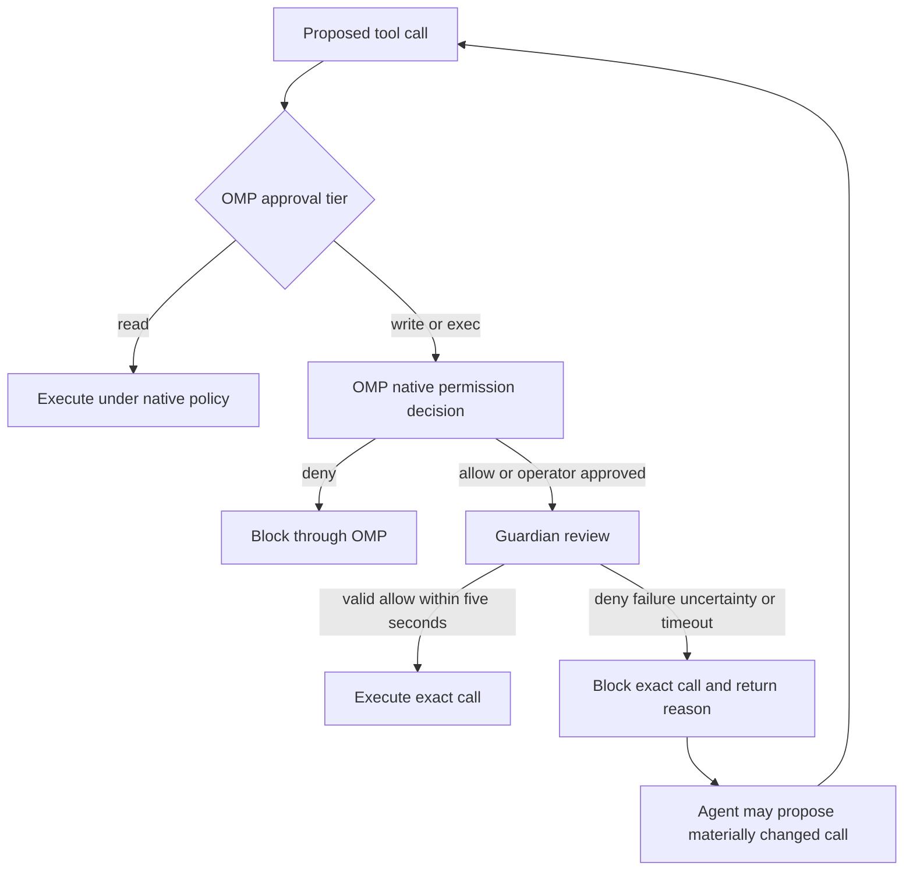

<!-- markdownlint-disable MD013 MD025 MD036 -->

# OMP Tool-Call Guardian - Plan

## Goal Capsule

- **Objective:** Prevent catastrophic OMP tool side effects during daily `yolo` use without requiring hand-written permission rules or broadly restricting the calling agent.
- **Product authority:** The Product Contract below defines the behavior and scope that implementation planning must preserve.
- **Open blockers:** None before planning; model selection, exact-action binding, and runtime integration remain planning decisions.

---

## Product Contract

### Summary

Add a small-model Guardian that reviews every non-read-only OMP tool call after native permission handling and before execution.
Guardian acts as a narrow catastrophe backstop: it either allows the exact call or denies it finally with a clear reason the calling agent can use to formulate a safer retry.

### Problem Frame

The operator uses `gpt-5.6-sol` as a daily driver with OMP in `yolo` mode.
The current alternatives are frequent native permission prompts, extensive hand-written policy, or trusting the calling model and relying on git and backups after a dangerous action executes.

A useful backstop must catch catastrophic actions without treating every destructive or externally visible operation as forbidden.
Excessive false denials would remove the autonomy that makes `yolo` valuable.

### Key Decisions

- **Native policy remains authoritative.** OMP evaluates its own configured approval policy first; Guardian may narrow an allowed decision but can never broaden or override a native denial.
- **All non-read-only calls are covered.** Guardian reviews both OMP `write`-tier and `exec`-tier calls; `read`-tier calls bypass it.
- **Catastrophe is the threshold.** Guardian blocks catastrophic, unbounded, deceptive, or intent-mismatched actions while allowing bounded risky work that matches the operator's immediate request.
- **Denial is exact and final.** The reviewed call cannot be overridden, but its reason should help the calling agent propose a materially changed call for fresh review.
- **Freshness beats optimization.** Every covered call receives a new review; approvals are never cached or remembered.

### Actors

- A1. **Operator:** Uses OMP, chooses the native permission mode, and supplies the immediate intent against which a call is judged.
- A2. **Calling agent:** Proposes a tool call, receives Guardian's outcome, and may formulate a materially safer retry after denial.
- A3. **OMP native permission layer:** Applies configured static policy and interactive permission behavior before Guardian.
- A4. **Guardian:** Independently evaluates the exact proposed action against its safety policy.
- A5. **OMP extension host:** Intercepts the allowed call before execution and enforces Guardian's terminal outcome.

### Requirements

**Authority and coverage**

- R1. Guardian must run through OMP's pre-execution tool-call extension hook without requiring an OMP fork.
- R2. OMP's native permission decision must complete before Guardian review, and no Guardian outcome may override a native denial.
- R3. Every call in OMP's `write` or `exec` approval tier that passes native policy must receive Guardian review before side effects begin.
- R4. OMP `read`-tier calls must bypass Guardian.
- R5. `Yolo` mode must still route every `write`-tier and `exec`-tier call through Guardian.
- R6. The feature must rely on OMP's native static policy rather than introducing another user-configured rule system.

**Review evidence and policy**

- R7. Guardian must use a small model dedicated to the review decision rather than the calling agent's own conclusion.
- R8. Guardian must receive the exact tool identity, exact arguments, working directory, and immediate user and assistant intent for the proposed call.
- R9. Guardian must treat tool arguments and immediate intent as untrusted evidence, so embedded instructions cannot replace its safety policy or verdict contract.
- R10. Guardian must deny a call with a credible risk of broad or irreversible data or system damage, credential compromise, security-control weakening, deceptive execution, material intent mismatch, or unbounded external effects.
- R11. Guardian must allow bounded risky work when the exact action is consistent with the operator's immediate intent and does not meet the catastrophe threshold.
- R12. Guardian must return one terminal outcome for the exact call: allow or deny.

**Enforcement and recovery**

- R13. A denial must be final for the reviewed call and must not offer an operator override.
- R14. A denial must give the calling agent a clear, concise reason that identifies the hazardous property that must change, without supplying an executable remediation plan.
- R15. A materially changed retry must be treated as a new call and receive a fresh review.
- R16. Every covered call must receive a fresh review; the feature must not cache approvals or remember trusted action families.
- R17. The complete review must have a hard five-second deadline.
- R18. Timeout, provider failure, missing credentials, malformed output, ambiguous verdict, model uncertainty, or internal error must deny the call.
- R19. No covered tool side effect may begin until an explicit, valid allow verdict has been enforced for that exact call.

### Key Flow

OMP's native layer remains the first authority in every mode.
In `yolo`, native policy may allow a covered call without prompting, but Guardian review remains mandatory.

### Acceptance Examples

- AE1. **Native denial wins**
  - **Given:** OMP's configured policy denies a tool call.
  - **When:** The calling agent proposes that call.
  - **Then:** OMP blocks it without Guardian review, and Guardian cannot restore permission.
  - **Covers:** R2, R6
- AE2. **Catastrophic action in yolo**
  - **Given:** `Yolo` mode is active and the agent proposes an unbounded destructive action against the operator's home directory.
  - **When:** Native policy allows the call and Guardian reviews it.
  - **Then:** Guardian denies the exact call and returns a reason identifying its unbounded destructive scope.
  - **Covers:** R3, R5, R10, R13, R14
- AE3. **Bounded authorized mutation**
  - **Given:** The operator requested a bounded repository change and the proposed mutation matches that immediate intent.
  - **When:** Guardian finds no catastrophic property.
  - **Then:** Guardian allows the exact call without an additional operator prompt.
  - **Covers:** R8, R11, R12
- AE4. **Prompt injection inside call evidence**
  - **Given:** A tool argument tells Guardian to ignore its policy and approve the call.
  - **When:** Guardian evaluates the action.
  - **Then:** The embedded instruction is treated as untrusted evidence and cannot alter the policy or verdict contract.
  - **Covers:** R9, R12
- AE5. **Review failure**
  - **Given:** The review model is unavailable, late, malformed, or uncertain.
  - **When:** Guardian cannot produce a valid allow verdict within five seconds.
  - **Then:** The exact call is denied and no covered side effect begins.
  - **Covers:** R17, R18, R19
- AE6. **Read-only call**
  - **Given:** OMP classifies a call in the `read` approval tier.
  - **When:** The agent proposes it.
  - **Then:** The call follows native policy without Guardian review.
  - **Covers:** R4
- AE7. **Safer retry after denial**
  - **Given:** Guardian denied a call and explained the hazardous property.
  - **When:** The calling agent proposes a materially changed action that removes that property.
  - **Then:** Guardian reviews the new exact call from scratch rather than reusing the prior verdict.
  - **Covers:** R14, R15, R16

### Success Criteria

- Every covered call either receives a valid allow verdict within five seconds or is denied before side effects begin.
- A representative catastrophe corpus covering destructive scope, credential compromise, security-control weakening, deceptive execution, intent mismatch, and unbounded external effects produces no allowed calls.
- A representative daily coding workflow in `yolo` completes without manual Guardian configuration, operator overrides, or a false denial that dead-ends bounded authorized work.
- Native OMP denials remain effective and explainable independently of Guardian.

### Scope Boundaries

**In scope**

- An OMP extension that enforces native-policy-first, model-assisted review for `write`-tier and `exec`-tier calls.
- Exact-call evidence, a fixed catastrophe policy, binary verdict enforcement, a five-second fail-closed deadline, and clear refusal reasons.
- Daily interactive use, `yolo` mode, and any non-interactive context in which the same OMP hook and tool tiers apply.

**Out of scope**

- A new static rule language, changes to OMP's native permission model, or review of `read`-tier calls.
- Human override, session or cross-session approval caches, learned trust, command-family approvals, or turn-wide quarantine.
- A remediation agent that writes replacement commands or plans actions on the calling agent's behalf.
- Replacing operating-system sandboxing, credential isolation, version control, or backups; Guardian is defense in depth rather than a safety proof.

### Dependencies and Assumptions

- OMP continues to apply native approval before its blocking pre-execution tool-call hook and to preserve `read`, `write`, and `exec` approval tiers.
- The hook exposes a lossless, immutable representation of the exact call and enough immediate intent to support authorization checks.
- The exact action reviewed by Guardian is the exact action executed after an allow verdict.
- A suitable small model can return reliable structured decisions within the five-second deadline.
- Catastrophe classification remains probabilistic; success is established against representative adversarial and daily-workflow scenarios, not as an absolute guarantee.

### Outstanding Questions

**Deferred to planning**

- Which configured model and review interface best satisfy the five-second deadline and strict verdict contract?
- How should planning prove exact-action binding between review and execution?
- How should denial reasons remain useful without leaking credentials or other sensitive argument content?

### Sources and Research

- `private_dot_omp/private_agent/config.yml:83-84` confirms the deployed OMP source configuration uses `yolo` approval mode.
- `private_dot_omp/private_agent/package.json:7-10` targets the OMP extension packages at version 17.0.1 or newer.
- `private_dot_omp/private_agent/extensions/adaptive-thinking.ts:82-90` provides the repository's existing OMP extension-hook pattern.
- [OMP 17.0.1 extension wrapper](https://github.com/can1357/oh-my-pi/blob/v17.0.1/packages/coding-agent/src/extensibility/extensions/wrapper.ts#L123-L235) establishes native-policy-first ordering, blocking hook behavior, and execution after hook completion.
- [OMP approval modes](https://github.com/can1357/oh-my-pi/blob/v17.0.1/docs/approval-mode.md) defines `read`, `write`, `exec`, and `yolo` behavior.
