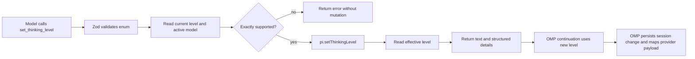

# OMP Adaptive Thinking Extension Design

**Date:** 2026-07-10
**Status:** Approved

## Context

The OMP configuration sets `defaultThinkingLevel: auto`, but the model cannot
currently request a different reasoning level while an agent run is in progress.
OMP 16.3.15 already exposes the correct extension seam:

```ts
pi.getThinkingLevel(): ThinkingLevel | undefined
pi.setThinkingLevel(level: ThinkingLevel): void
```

OMP re-reads the live thinking level before each provider call, persists
explicit changes in session history, clamps levels to model capabilities, and
maps its internal effort vocabulary to provider-specific request fields. A
custom extension therefore does not need to rewrite provider request payloads.

`~/src/pi-adaptive-thinking` demonstrates the model-facing-tool concept, but its
Pi-specific settings lock, temporary reset state, and event bookkeeping do not
transfer to OMP. In particular, OMP's public extension interface cannot read or
restore the configured `auto` selector. This design uses session-scoped explicit
changes only.

## Goals

- Give the model one tool for selecting an exact OMP thinking level during an
  agent run.
- Apply a successful change to the continuation request after the tool result
  and to later requests in the same session.
- Preserve OMP's capability handling, session persistence, and provider mappings
  by using the native thinking-level interface.
- Reject unsupported exact requests before they can silently pin an auto-managed
  session to a clamped level.
- Keep the extension host-loaded, dependency-free, and local to the existing
  chezmoi OMP configuration.

## Non-goals

- Temporary or single-run overrides.
- Restoring the `auto` selector after an explicit change.
- Relative increase/decrease operations.
- Global default-setting changes.
- Provider-specific request-body rewriting.
- A new package, workspace, build system, or user-configurable extension
  settings.
- Prompt injection beyond the registered tool's own description.

## Placement and Loading

Add one source file:

```text
dot_omp/agent/extensions/adaptive-thinking.ts
```

Chezmoi maps it to:

```text
~/.omp/agent/extensions/adaptive-thinking.ts
```

OMP auto-discovers TypeScript extensions in that user extension directory. No
config registration is required. The file default-exports an OMP extension
factory and uses a type-only `ExtensionAPI` import from
`@oh-my-pi/pi-coding-agent`, the package exported by the installed OMP 16.3.15
runtime.

The existing live `~/.omp/agent` tree contains machine-local configuration not
represented in the chezmoi source. Verification must target this single source
file and its mapped destination; it must not apply or overwrite unrelated OMP
configuration.

## Module and Interface

The extension is one module with one model-facing interface:

```ts
set_thinking_level({
  level: "off" | "minimal" | "low" | "medium" | "high" | "xhigh"
})
```

The factory obtains Zod from `pi.zod` and registers the tool through
`pi.registerTool()`. The tool description states that:

- the selected level applies to subsequent model calls in the current session;
- it remains active until the model or user selects another level;
- a successful explicit selection replaces automatic thinking-level selection
  for that session.

The tool schema admits only OMP's concrete `ThinkingLevel` values. `auto` is
intentionally absent because `pi.setThinkingLevel()` does not accept it.
Register the session-state mutation with `approval: "write"` so it follows OMP's
normal write-mode permission policy instead of the extension-tool `exec`
default.

## Capability Validation

The interface promises an exact level, so the extension validates support before
mutation rather than relying only on OMP's fallback clamping.

For an execution context with an active model, the supported values are:

```ts
["off", ...(ctx.model.thinking?.efforts ?? [])]
```

Rules:

1. `off` is always accepted. OMP represents it by disabling reasoning rather
   than by advertising it in `model.thinking.efforts`.
2. A non-`off` level is accepted only when it is present in
   `ctx.model.thinking.efforts`.
3. A non-`off` request without an active model is rejected because support
   cannot be established.
4. `model.reasoning` alone is not evidence that an effort level is controllable;
   reasoning models may intentionally expose no effort surface.
5. Every valid request calls `pi.setThinkingLevel()`, even when the requested
   level already matches the current effective level. OMP treats that call as an
   explicit session selection and exits auto mode; skipping it would violate the
   tool's session-persistent selection contract.

## Data Flow



The extension owns only validation and result reporting. OMP owns runtime state,
session history, model/provider compatibility, and request construction.

## Result Contract

A successful explicit selection returns one text content block and structured
details:

The host's full `ThinkingLevel` also includes `inherit`, and
`getThinkingLevel()` may return `undefined`. Neither value is a concrete tool
selection. Structured details normalize both to `null`, and text renders both as
`provider default`; output never exposes raw `inherit` or JavaScript
`undefined`.

```ts
{
  requestedLevel,
  previousLevel: previousLevel ?? null,
  effectiveLevel: effectiveLevel ?? null,
  applied: true,
  effectiveChanged: effectiveLevel !== previousLevel
}
```

Calling the setter can change session selection state even when the effective
level does not change. `applied` therefore records that OMP accepted the
explicit selection, while `effectiveChanged` compares the concrete level before
and after the call. The text must say that the level was explicitly set for the
session and name the effective level.

## Error Handling

- **Unsupported exact level:** return a tool result with `isError: true` that
  names the requested level and lists the active model's supported values. Do
  not call the setter.
- **No active model:** reject non-`off` requests with an `isError: true` tool
  result. Do not call the setter.
- **Unexpected effective mismatch after setting:** return an `isError: true`
  tool result containing the requested, previous, and effective levels. Normalize
  an unavailable previous or effective value to `null` in details and
  `provider default` in text. The effective level remains OMP's runtime state;
  the extension must not guess at a rollback because it cannot restore `auto`
  faithfully.
- **Setter failure:** allow the exception to propagate so OMP converts it to its
  standard failed-tool representation.
- **Invalid enum value:** leave rejection to the registered Zod schema.

The extension does not keep module-global runtime state and requires no
lifecycle handlers.

## Verification

### Focused behavior harness

Load the extension with Bun against a small mock of the OMP extension interface,
capture the registered tool, and exercise it through its public `execute`
interface. Verify these observable contracts:

1. A supported exact change invokes `setThinkingLevel()` once and reports the
   previous and effective levels.
2. A same-effective-level request still invokes the setter, reports
   `applied: true`, and reports `effectiveChanged: false`.
3. An unsupported request does not invoke the setter and reports the supported
   values.
4. A non-`off` request without an active model is rejected without mutation.
5. `off` remains accepted even when no model effort metadata is available.
6. An unexpected post-set mismatch is surfaced as a failed result with both
   requested and effective values.
7. An `inherit` or undefined previous/effective host level is represented as
   `null` in details and `provider default` in text.

### Installed OMP smoke test

Start a fresh installed-OMP session with the extension loaded, cause the model
to call `set_thinking_level`, and verify:

1. OMP exposes the tool to the model.
2. The tool result reports the requested and effective levels.
3. The provider continuation after the tool result runs with the new level.
4. The session records the explicit thinking-level change.

### Chezmoi mapping check

Verify that chezmoi maps only `dot_omp/agent/extensions/adaptive-thinking.ts` to
`~/.omp/agent/extensions/adaptive-thinking.ts`. Do not apply the full source
tree while live OMP configuration differs from the checked-in source.

## Risks and Mitigations

- **Explicit selection exits auto mode for the session.** The tool description
  states this plainly. Every valid call pins the requested concrete level,
  including when it already matches the auto-resolved effective level.
- **Model capability metadata may be absent.** Reject non-`off` requests rather
  than infer support or depend on clamping.
- **The active model could change during execution.** Re-read the effective
  level after setting and surface any mismatch; do not hide it as success.
- **Source/runtime configuration drift could overwrite unrelated settings.**
  Deploy or inspect only the new mapped extension file during verification.

## Rejected Alternatives

### Temporary and persistent scopes

Rejected because OMP 16.3.15 exposes only the effective concrete level. It does
not expose whether the session is configured for `auto`, does not accept `auto`
through the public setter, and does not emit a public selection-change event. A
temporary override could therefore restore only a concrete snapshot and silently
disable auto behavior.

### Provider request middleware

Rejected because `before_provider_request` exposes an intentionally unknown
payload with provider-specific encodings. It would bypass OMP's durable session
state and duplicate compatibility behavior already hidden behind
`pi.setThinkingLevel()`.

### Dedicated package and policy adapter

Rejected because the requested behavior has one narrow interface and no
independent state machine. A package boundary, build configuration, and mock
adapter would add more interface than implementation and establish a second OMP
tooling convention in this repository.
